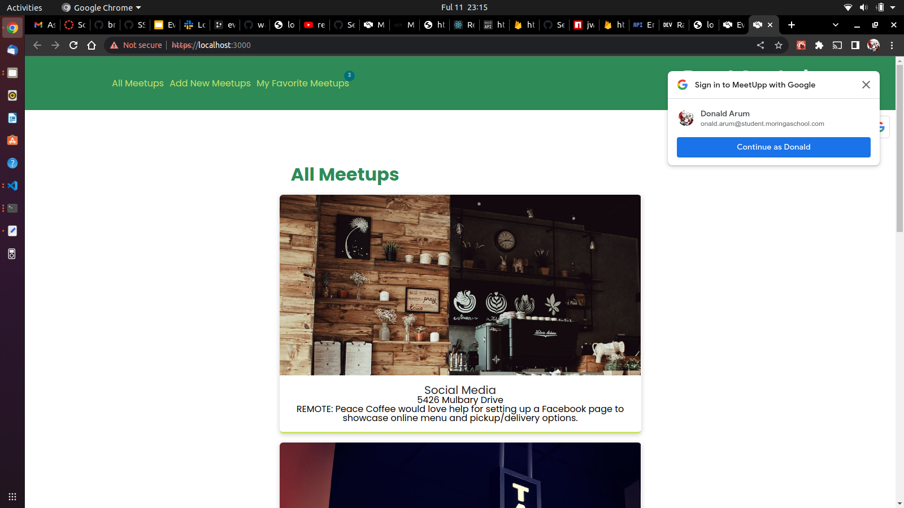
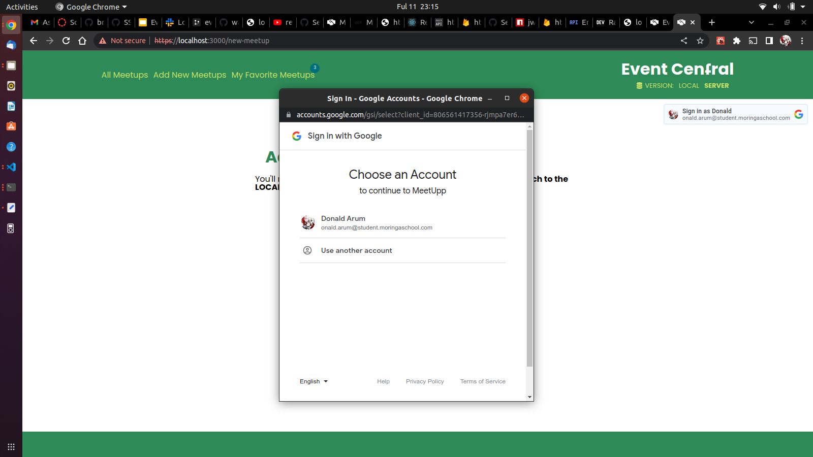

# Community Events Management System Front-end
 ## By Donald Brooks Arum
## Screenshots
 
 
 
 ## Table of Content
 - [Description](#description)
 - [Features](#features)
 - [Live Link](#Live-Link)
 - [Technology  Used](#technology-Used)
 - [Licence](#licence)
 - [Authors Info](#Authors-Info)

 ## Description
 
This project is a simple responsive fullstack website that leverages the local api made using Ruby Sinatra that is publicly available for use

 [Go Back to the top](#community-events-management-system-front-end)

 ## Features
As a user of the website,you will be able to :
1. Log in to the Website using google OAuth to allow access
2. Scan through the new Events to see a brief overview of each individual event and add show interest by adding them to favorites
3. Create new events on the site after logging in and leverage the platform to gain attendees 
[Go Back to the top](#community-events-management-system-front-end)

 ###  Requirements
 * Access to  a computer or any other gadget
 * Access to internet
 ### Installation Process
 ****
* Clone to the repo : git clone https://github.com/brooksd/community-events-management-system-front-end.git

* Unzip the downloaded files in a folder of choice.
* Open the index file from the zipped file with any browser.
 ****
[Go Back to the top](#community-events-management-system-front-end)

### Live Link
- Click this link to view the live application 
### Technology  Used
* HTML - The Markup language was used in building the base structure of the webpage.
* CSS - which was used to style the HTML structure to achieve the visual result with a big emphasis on { display:flex; }.
* React JS - Mostly used to dynamically render the events to DOM fetch data from the API and also improve interactivity with on the website for the user
* Goole OAuth - Handles the Authentication of the user
[Go Back to the top](#community-events-management-system-front-end)
## Licence
MIT License
Copyright (c) [2022] [Donald Brooks Arum]

Permission is hereby granted, free of charge, to any person obtaining a copy
of this software and associated documentation files (the "Software"), to deal
in the Software without restriction, including without limitation the rights
to use, copy, modify, merge, publish, distribute, sublicense, and/or sell
copies of the Software, and to permit persons to whom the Software is
furnished to do so, subject to the following conditions:
The above copyright notice and this permission notice shall be included in all
copies or substantial portions of the Software.
THE SOFTWARE IS PROVIDED "AS IS", WITHOUT WARRANTY OF ANY KIND, EXPRESS OR
IMPLIED, INCLUDING BUT NOT LIMITED TO THE WARRANTIES OF MERCHANTABILITY,
FITNESS FOR A PARTICULAR PURPOSE AND NONINFRINGEMENT. IN NO EVENT SHALL THE
AUTHORS OR COPYRIGHT HOLDERS BE LIABLE FOR ANY CLAIM, DAMAGES OR OTHER
LIABILITY, WHETHER IN AN ACTION OF CONTRACT, TORT OR OTHERWISE, ARISING FROM,
OUT OF OR IN CONNECTION WITH THE SOFTWARE OR THE USE OR OTHER DEALINGS IN THE
SOFTWARE.
[Go Back to the top](#community-events-management-system-front-end)
## Authors Info
Linkedin - [Donald Brooks Arum](https://ke.linkedin.com/in/donald-brooks-91574a188)
   
[Go Back to the top](#community-events-management-system-front-end)